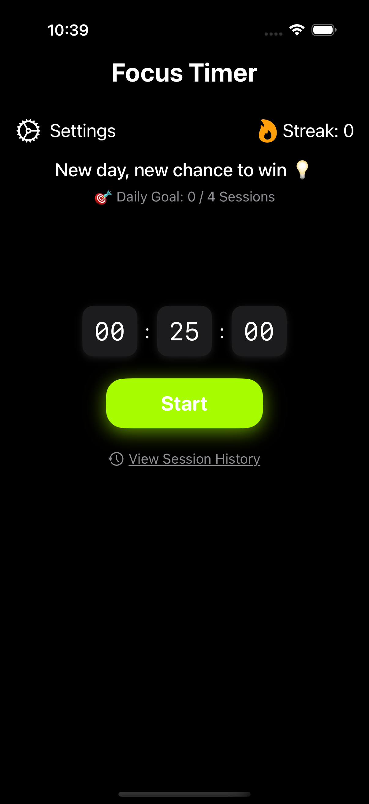
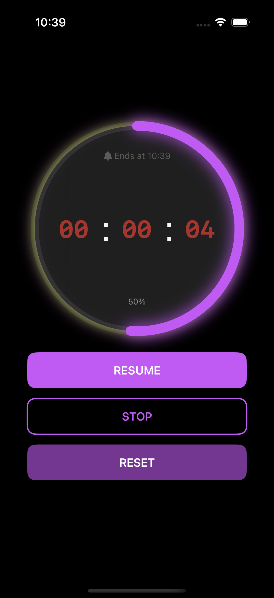
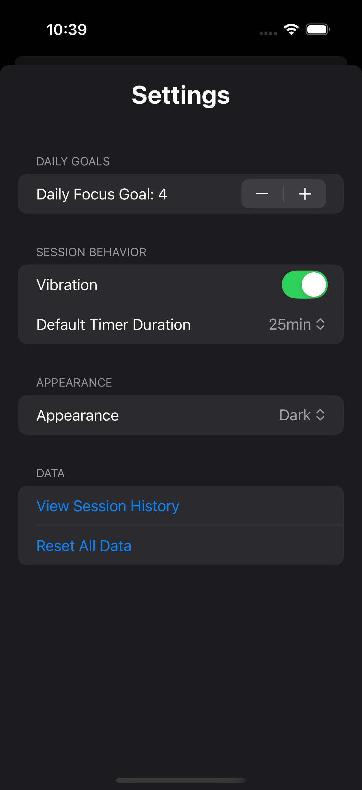
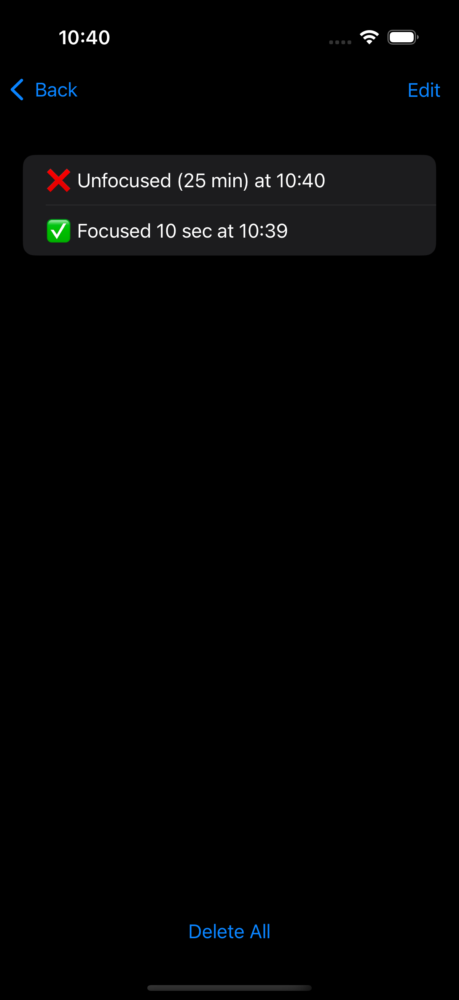

# ⏱ FocusTimer

A beautifully designed and minimal **productivity timer app** built with **SwiftUI**. Designed to help users stay focused, track sessions, and build daily habits.

---

## 📱 Features

- Custom duration input (Hours, Minutes, Seconds)
- Start / Pause / Reset Timer
- Circular animated progress bar with live percentage
- Vibration feedback on session completion (device-supported)
- Daily session goal tracker & streak counter
- Session history with timestamped logs
- Light & Dark mode toggle
- Onboarding welcome screens (first launch only)
- Persistent user data with `@AppStorage`

---

## 📸 Screenshots

| Home | Progress View | Settings | History |
|------|---------------|----------|---------|
|  |  |  |  | |

---

## 🔧 Built With

- `Swift`
- `SwiftUI`
- `MVVM` Architecture
- `@AppStorage` for user preferences
- `GeometryReader`, `ViewModifiers`, `FocusState`, etc.

---

## 🚀 Getting Started

To run the app locally:

1. Clone this repo
2. Open in **Xcode 15+**
3. Run on simulator or real device

---

## 🧠 Inspiration

This project was built as a **self-learning challenge** to master SwiftUI, structure code properly, and create a real-world app from scratch — not just follow tutorials.

---

## 🗂 Folder Structure (Simplified)

<pre>
📁 Views/
📁 ViewModels/
📁 Models/
📁 Extensions/
📁 Resources/
</pre>

---

## 🙌 Author

**Dilipan Prabha**  
[GitHub Profile](https://github.com/dilipanprabha) 

---

## 📄 License

This project is for educational purposes. Feel free to fork or learn from it.
